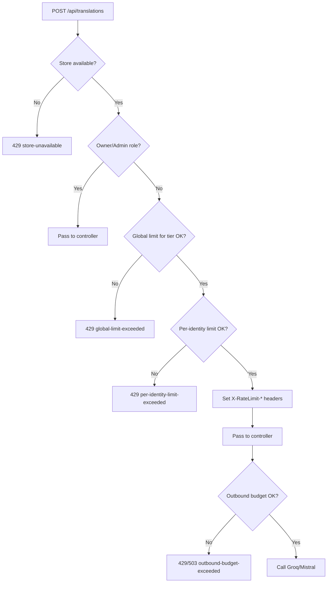

# Rate Limiting: Implementation Plan

**Feature**: API Rate Limiting
**Date**: 2026-04-14
**Spec**: `docs/features/rate-limiting/spec.md`
**Research**: `docs/features/rate-limiting/research.md`

## Referenced ADRs

| ADR | Decision |
|---|---|
| ADR 0001: Rate Limit Backing Store | In-memory `IRateLimitStore`; Redis migration path via interface |
| ADR 0002: Rate Limit Failure Policy | Fail-closed: reject on store unavailability |
| ADR 0003: Rate Limit Algorithm | Token bucket with continuous refill |

## Implementation Phases

### Phase 1: Store Abstraction and Token Bucket

**Goal**: Implement the `IRateLimitStore` interface and its in-memory token bucket implementation. No middleware, no HTTP concerns.

**Files to create**:

```
src/LearnLuxembourgish.Api/RateLimiting/
  IRateLimitStore.cs
  TokenBucketResult.cs
  InMemoryRateLimitStore.cs
  RateLimitOptions.cs
```

**`IRateLimitStore` contract**:

```csharp
public interface IRateLimitStore
{
    Task<TokenBucketResult> TryConsumeAsync(
        string key, int maxTokens, TimeSpan window, CancellationToken ct = default);

    Task<bool> IsAvailableAsync(CancellationToken ct = default);
}

public record TokenBucketResult(
    bool Allowed,
    int Remaining,
    DateTimeOffset ResetAt);
```

**`RateLimitOptions`** maps directly to the configuration schema in `research.md`. Loaded via `IOptions<RateLimitOptions>` and registered as a named section `"RateLimiting"`.

**`InMemoryRateLimitStore`** uses `ConcurrentDictionary<string, object>` with a lock per entry for the check-and-update sequence. The token bucket arithmetic follows the computation described in ADR 0003. `IsAvailableAsync` always returns `true`.

**Tests** (`tests/LearnLuxembourgish.Tests/RateLimiting/InMemoryRateLimitStoreTests.cs`):

- A full bucket allows the first request.
- A bucket at zero tokens rejects the next request.
- Tokens refill proportionally after elapsed time.
- Concurrent calls from multiple threads do not produce more allowed requests than the quota.
- `ResetAt` is in the future when a request is rejected.
- `IsAvailableAsync` returns true.

### Phase 2: Inbound Rate Limit Middleware

**Goal**: Enforce all inbound policies on `POST /api/translations`. Owner/Admin bypass, global-before-per-identity ordering, fail-closed behaviour, response headers.

**Files to create**:

```
src/LearnLuxembourgish.Api/RateLimiting/
  TranslationRateLimitMiddleware.cs
  RateLimitResponseWriter.cs
```

**`TranslationRateLimitMiddleware`** logic (in order):

1. If the request path and method are not `POST /api/translations`, call `next` immediately. No other endpoint is affected.
2. Attempt `IRateLimitStore.IsAvailableAsync()`. If false or throws: write fail-closed 429 response with `X-RateLimit-Error: store-unavailable` and return.
3. Read caller identity: if the request has a valid JWT with a sub claim, caller is authenticated; otherwise caller is identified by `HttpContext.Connection.RemoteIpAddress`.
4. If caller has Owner/Admin role: call `next` immediately. No headers added.
5. Determine tier (Unauthenticated | Authenticated) and resolve the corresponding policy from `RateLimitOptions`.
6. Call `TryConsumeAsync` on global key for the tier. If `!Allowed`: write 429 with `X-RateLimit-Error: global-limit-exceeded` + `Retry-After` header. Return.
7. Call `TryConsumeAsync` on per-identity key. If `!Allowed`: write 429 with `X-RateLimit-Error: per-identity-limit-exceeded` + `Retry-After` header. Return.
8. Add `X-RateLimit-Limit`, `X-RateLimit-Remaining`, `X-RateLimit-Reset` headers to the response using the per-identity result.
9. Call `next`.

**`RateLimitResponseWriter`** is a helper that writes the 429 response body (JSON with a human-readable message and error code) and sets all required headers. Extracted to a separate class because the same response structure is used by the outbound budget path.

**Registration in `Program.cs`**:

```csharp
builder.Services.AddSingleton<IRateLimitStore, InMemoryRateLimitStore>();
builder.Services.Configure<RateLimitOptions>(
    builder.Configuration.GetSection("RateLimiting"));
// ...
app.UseMiddleware<TranslationRateLimitMiddleware>();
// Must be placed after UseAuthentication() and UseAuthorization()
// so that the User principal is populated when the middleware runs.
```

**Tests** (`tests/LearnLuxembourgish.Tests/RateLimiting/TranslationRateLimitMiddlewareTests.cs`):

These tests use `WebApplicationFactory` or a test `HttpClient` with a mock `IRateLimitStore`.

- Non-translation paths pass through without calling the store.
- Unauthenticated caller: first request is HTTP 200 with correct headers.
- Unauthenticated caller: second request within window is HTTP 429.
- Authenticated caller: quota is 5; request 6 is HTTP 429.
- Owner/Admin: HTTP 200 regardless of store state.
- Store unavailable: HTTP 429 with `X-RateLimit-Error: store-unavailable`.
- Global unauthenticated limit reached: HTTP 429 for a new IP (per-identity counter untouched).
- Global authenticated limit reached: HTTP 429 for a valid user who has personal quota remaining.
- Response headers present on HTTP 200 responses (non-owner/admin).
- HTTP 429 response includes `Retry-After` header.

### Phase 3: Outbound LLM Call Budget

**Goal**: Prevent cost overruns by checking an independent outbound budget inside `GrammarService` before any call to Groq/Mistral.

**Files to create**:

```
src/LearnLuxembourgish.Api/RateLimiting/
  IOutboundCallBudget.cs
  OutboundCallBudget.cs
  OutboundBudgetExceededException.cs
```

**`IOutboundCallBudget` contract**:

```csharp
public interface IOutboundCallBudget
{
    Task<TokenBucketResult> TryConsumeAsync(CancellationToken ct = default);
}
```

**`OutboundCallBudget`** wraps `IRateLimitStore` with the fixed key `outbound:llm` and reads `RateLimitOptions.Outbound.Llm` for max tokens and window.

**`GrammarService` modification**: Inject `IOutboundCallBudget`. At the start of the LLM call path, call `TryConsumeAsync`. If `!Allowed`, throw `OutboundBudgetExceededException`.

**`TranslationsController` modification**: Catch `OutboundBudgetExceededException` and return HTTP 429 (or 503 per the team's decision; see `research.md` identified risks). Return a structured response body consistent with inbound 429 responses.

**Note**: Owner/Admin callers bypass inbound limits but do NOT bypass the outbound LLM budget. The budget check occurs inside `GrammarService`, after any inbound middleware bypass. This is intentional and is the last line of defence against cost overruns (per spec User Story 5).

**Tests** (`tests/LearnLuxembourgish.Tests/RateLimiting/OutboundCallBudgetTests.cs`):

- TryConsumeAsync returns Allowed = true when budget has tokens.
- TryConsumeAsync returns Allowed = false when budget is exhausted.
- GrammarService throws OutboundBudgetExceededException when budget is exhausted.
- Controller returns 429 when OutboundBudgetExceededException is thrown.
- Owner/Admin request correctly triggers outbound budget check (not bypassed).

### Phase 4: Configuration Wiring and Integration Tests

**Goal**: Wire the configuration section into `appsettings.json` for all environments, and validate the full acceptance scenarios from the spec with integration tests.

**`appsettings.json` addition** (defaults):

```json
"RateLimiting": {
  "Unauthenticated": {
    "PerIp": { "MaxTokens": 1, "WindowMinutes": 60 },
    "Global": { "MaxTokens": 10, "WindowMinutes": 60 }
  },
  "Authenticated": {
    "PerUser": { "MaxTokens": 5, "WindowMinutes": 60 },
    "Global": { "MaxTokens": 50, "WindowMinutes": 60 }
  },
  "Outbound": {
    "Llm": { "MaxTokens": 100, "WindowMinutes": 60 }
  }
}
```

**Integration tests** (`tests/LearnLuxembourgish.Tests/RateLimiting/RateLimitIntegrationTests.cs`):

Each test maps directly to a spec acceptance scenario:

| Scenario | Assertion |
|---|---|
| US1-AC1: First anonymous request | HTTP 200, `X-RateLimit-Remaining: 0` |
| US1-AC2: Second anonymous request within window | HTTP 429, `Retry-After` present |
| US2-AC1: 11th request from distinct IPs | HTTP 429 (global exhausted) |
| US2-AC2: After global reset | HTTP 200 |
| US3-AC1: Authenticated user, 5th request | HTTP 200, `X-RateLimit-Remaining: 0` |
| US3-AC2: Authenticated user, 6th request | HTTP 429 |
| US3-AC3: Authenticated user with personal quota, but global auth exhausted | HTTP 429 |
| US4-AC1: Owner/Admin after global limits exhausted | HTTP 200 |
| US4-AC2: Owner/Admin, any number of requests | Never HTTP 429 from rate limiting |
| US5-AC1: Outbound budget exhausted | HTTP 429 or 503 |
| US5-AC2: After outbound window resets | HTTP 200 |

Integration tests should use a small `WindowMinutes` value (e.g., 1 second) or mock `DateTimeOffset.UtcNow` to test window reset behavior without real time delays.

## Sequence: Request Evaluation Order



## Ordering Constraint

The `TranslationRateLimitMiddleware` must be registered AFTER `app.UseAuthentication()` and `app.UseAuthorization()` in `Program.cs`. The middleware reads `HttpContext.User` to determine caller identity and tier. If registered before authentication middleware, `HttpContext.User` will always be unauthenticated.

## Future Extension Points

- **Subscription tiers** (FR-010): Adding a new tier requires adding a new policy entry to `RateLimitOptions` and a corresponding branch in `TranslationRateLimitMiddleware`. The `IRateLimitStore` interface does not change.
- **Redis migration** (ADR 0001): Register `RedisRateLimitStore` in place of `InMemoryRateLimitStore` in `Program.cs`. All middleware, budget, and test code unchanged.
- **IP prefix normalisation for IPv6**: Read `X-Forwarded-For` and normalise IPv6 to /64 prefix. No interface changes; identity key construction logic in middleware.

## Commands

Executable commands for this project (copy and run directly):

### Build

```
dotnet build --configuration Release
```

### Tests

```
dotnet test --verbosity normal
```

### Lint / Formatting

```
dotnet format --verify-no-changes
```

### Local Execution

```
dotnet run --project src/LearnLuxembourgish.AppHost
```
